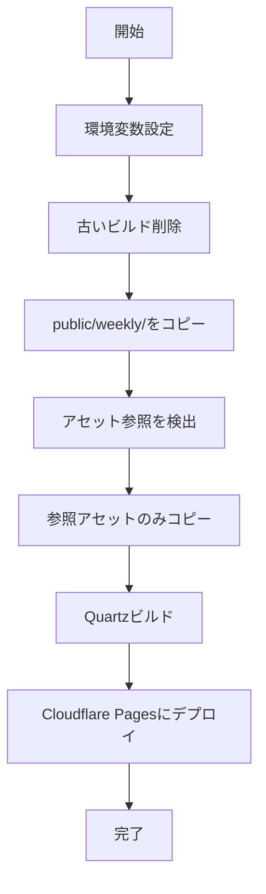

# Quartzブログ自動デプロイシステム 完全ドキュメント

**作成日**: 2025-10-19  
**最終更新**: 2025-10-19  
**システムバージョン**: 1.0

---

## 目次

1. [システム概要](#システム概要)
2. [アーキテクチャ](#アーキテクチャ)
3. [ディレクトリ構成](#ディレクトリ構成)
4. [セットアップ手順](#セットアップ手順)
5. [日常運用](#日常運用)
6. [定期保守](#定期保守)
7. [トラブルシューティング](#トラブルシューティング)
8. [技術的詳細](#技術的詳細)

---

## システム概要

### 目的

複数デバイス（Mac mini, MacBook, Android）で編集するMarkdownメモ（PKM）から、公開記事のみを自動抽出し、静的サイトとしてCloudflare Pagesに公開する。

### 主要機能

- **マルチデバイス同期**: SyncThingによる自動同期
- **選択的公開**: `public/`, `weekly/` のみを公開
- **アセット管理**: 参照されている画像のみを自動抽出
- **自動デプロイ**: 15分ごとに最新状態を反映
- **Git管理**: システム設定をバージョン管理（コンテンツは除外）

### 技術スタック

- **静的サイトジェネレーター**: Quartz v4
- **コンテナ**: Docker + Docker Compose
- **同期**: SyncThing
- **ホスティング**: Cloudflare Pages
- **自動化**: cron + logrotate
- **バージョン管理**: Git + GitHub（サブモジュール）

---

## アーキテクチャ

### 全体構成図

```
[編集デバイス] → [SyncThing] → [Raspberry Pi] → [Docker] → [Cloudflare Pages]
    ↓                              ↓              ↓
Mac mini/MacBook/Android        NAS HDD        隔離環境       glxy96.com
```

### コンポーネント詳細

#### 1. コンテンツ層（PKM）

**場所**: `/srv/dev-disk-by-uuid-xxx/dataFolder/pkm`

```
pkm/
├── public/          # 公開記事
├── weekly/          # 週報（公開）
├── daily/           # 日報（非公開）
├── inbox/           # 下書き（非公開）
├── templates/       # テンプレート（非公開）
└── assets/          # メディアファイル（参照分のみ公開）
```

- **Git管理**: しない（SyncThingで同期）
- **役割**: 編集の原本

#### 2. ビルド設定層

**場所**: `/srv/dev-disk-by-uuid-xxx/docker/quartz`  
**リポジトリ**: `glxy96/glxy96-pkm-blog`

```
quartz/
├── quartz/              # サブモジュール（Quartzエンジン）
├── Dockerfile.deploy    # ビルド環境定義
├── docker-compose.yml   # コンテナ設定
├── deploy.sh            # デプロイスクリプト
├── secrets/             # APIトークン（Git除外）
│   └── cloudflare_api_token
├── .gitignore
├── .gitmodules
└── deploy.log           # 実行ログ
```

- **Git管理**: する
- **役割**: システム設定の保管

#### 3. Quartzエンジン層

**場所**: `quartz/`（サブモジュール）  
**リポジトリ**: `glxy96/quartz`（フォーク元: `jackyzha0/quartz`）

- **Git管理**: サブモジュールとして
- **役割**: 静的サイト生成エンジン
- **更新**: Dependabotで自動PR

#### 4. ビルド実行層（Docker）

**イメージ**: `quartz-quartz-deploy`

- **ベース**: `node:22-slim`
- **追加ツール**: rsync, wrangler
- **役割**: 隔離されたビルド環境

#### 5. 公開層

- **URL**: https://glxy96-pkm-blog.pages.dev
- **カスタムドメイン**: glxy96.com（設定予定）
- **プロバイダー**: Cloudflare Pages

---

## ディレクトリ構成

### Raspberry Pi 全体

```
/srv/dev-disk-by-uuid-xxx/
└── dataFolder/
    ├── pkm/                    # SyncThing同期
    │   ├── public/
    │   ├── weekly/
    │   ├── daily/
    │   ├── inbox/
    │   ├── templates/
    │   └── assets/
    └── docker/
        └── quartz/             # Gitリポジトリ
            ├── quartz/         # サブモジュール
            │   ├── quartz.config.ts  # ★重要★
            │   ├── package.json
            │   └── ...
            ├── Dockerfile.deploy
            ├── docker-compose.yml
            ├── deploy.sh
            ├── secrets/
            └── deploy.log
```

### 重要ファイル解説

#### `quartz/quartz.config.ts`

Quartzの設定ファイル。サイトの見た目や動作を制御。

```typescript
const config: QuartzConfig = {
  configuration: {
    pageTitle: "glxy96.com",
    baseUrl: "glxy96.com",
    locale: "ja-JP",
    paths: {
      content: path.resolve(__dirname, "content"),
      resources: path.resolve(__dirname, "quartz/resources"),
    },
    ignorePatterns: ["private", "templates", ".obsidian"],
    // ...
  },
  plugins: {
    transformers: [...],
    filters: [Plugin.RemoveDrafts()],
    emitters: [...],
  },
}
```

**変更頻度**: 低（テーマ変更時など）

#### `docker-compose.yml`

Dockerコンテナの起動設定。

```yaml
services:
  quartz-deploy:
    build:
      context: .
      dockerfile: Dockerfile.deploy
    volumes:
      - /srv/.../pkm:/pkm_host:ro
    environment:
      - CLOUDFLARE_PROJECT_NAME=glxy96-pkm-blog
    secrets:
      - cloudflare_api_token
```

**変更頻度**: 極低（パス変更時のみ）

#### `deploy.sh`

デプロイの心臓部。以下の処理を実行：

1. 古いビルドを削除
2. `public/`, `weekly/` を `/app/content` にコピー
3. 記事内のアセット参照を検出
4. 参照されているアセットのみをコピー
5. Quartzビルド
6. Cloudflare Pagesにデプロイ

**変更頻度**: 低（ロジック変更時のみ）

---

## セットアップ手順

### 前提条件

- Raspberry Pi + OpenMediaVault 7
- Docker + Docker Compose
- SyncThing（複数デバイス間で同期済み）
- Cloudflare アカウント

### 初期構築（記録）

**注意**: 以下は構築済みのため、再実行不要。参考として記載。

#### 1. 必要なパッケージ

```bash
sudo apt update
sudo apt install -y git
```

#### 2. リポジトリクローン

```bash
cd /srv/dev-disk-by-uuid-xxx/docker
mkdir -p quartz
cd quartz
git clone --recursive https://github.com/glxy96/glxy96-pkm-blog.git .
```

#### 3. Cloudflare API Token設定

```bash
mkdir -p secrets
chmod 700 secrets
echo "YOUR_API_TOKEN" > secrets/cloudflare_api_token
chmod 600 secrets/cloudflare_api_token
```

#### 4. Dockerイメージビルド

```bash
docker compose build
```

#### 5. Cloudflare Pagesプロジェクト作成

```bash
docker compose run --rm quartz-deploy /bin/bash
wrangler pages project create glxy96-pkm-blog
exit
```

#### 6. 初回デプロイテスト

```bash
docker compose run --rm quartz-deploy
```

#### 7. cron設定

```bash
crontab -e
```

追加内容：

```cron
*/15 * * * * cd /srv/dev-disk-by-uuid-faae0ba6-5257-46ef-a8d2-3d96c3540f6d/docker/quartz && { echo "--- $(date '+%Y-%m-%d %H:%M:%S') ---"; /usr/bin/docker compose run --rm quartz-deploy; } >> /srv/dev-disk-by-uuid-faae0ba6-5257-46ef-a8d2-3d96c3540f6d/docker/quartz/deploy.log 2>&1
```

#### 8. logrotate設定

```bash
sudo nano /etc/logrotate.d/quartz-deploy
```

内容：

```
/srv/dev-disk-by-uuid-faae0ba6-5257-46ef-a8d2-3d96c3540f6d/docker/quartz/deploy.log
{
    daily
    rotate 7
    missingok
    notifempty
    compress
    delaycompress
    create 0644 ginga users
}
```

---

## 日常運用

### 記事を書く・編集する

1. **任意のデバイス**で `~/pkm/public/` または `~/pkm/weekly/` 内のMarkdownファイルを編集
2. **SyncThingが自動同期**（通常数秒〜数分）
3. **cronが15分以内に自動デプロイ**

**画像を使う場合**:
- `~/pkm/assets/` に画像を配置
- Markdown内で参照: `![[image.png]]` または ``

### 手動で即座にデプロイ

cronを待たずにすぐ反映したい場合：

```bash
cd /srv/dev-disk-by-uuid-faae0ba6-5257-46ef-a8d2-3d96c3540f6d/docker/quartz
docker compose run --rm quartz-deploy
```

### デプロイ状況の確認

#### ログ確認

```bash
# 最新30行
tail -n 30 /srv/dev-disk-by-uuid-faae0ba6-5257-46ef-a8d2-3d96c3540f6d/docker/quartz/deploy.log

# リアルタイム監視
tail -f /srv/dev-disk-by-uuid-faae0ba6-5257-46ef-a8d2-3d96c3540f6d/docker/quartz/deploy.log
```

#### 成功の確認

ログ内に以下が表示されていればOK：

```
✨ Deployment complete! Take a peek over at https://...
INFO: デプロイが完了しました。
```

### cron実行履歴の確認

```bash
# cronの実行履歴
grep CRON /var/log/syslog | grep quartz | tail -n 20
```

---

## 定期保守

### 月次タスク

#### 1. ログの確認（月1回）

```bash
# エラーの有無を確認
grep -i "error\|failed\|warn" /srv/dev-disk-by-uuid-xxx/docker/quartz/deploy.log | tail -n 50
```

#### 2. ディスク使用量の確認

```bash
# Dockerイメージのサイズ
docker images | grep quartz

# pkmディレクトリのサイズ
du -sh /srv/dev-disk-by-uuid-xxx/dataFolder/pkm
```

#### 3. SyncThing同期状態の確認

SyncThing Web UI (http://192.168.50.200:8384) で：
- すべてのデバイスが「同期済み」か確認
- エラーがないか確認

### 四半期タスク（3ヶ月ごと）

#### 1. Quartz更新の確認

GitHubで以下をチェック：

**[glxy96/quartz](https://github.com/glxy96/quartz)** (フォーク):
- Dependabotからの更新PR
- 公式 `jackyzha0/quartz` との差分

**[glxy96/glxy96-pkm-blog](https://github.com/glxy96/glxy96-pkm-blog)** (本リポジトリ):
- サブモジュール更新PR

#### 2. PR内容の確認とマージ

**安全な更新方法**:

1. PRの内容を確認（破壊的変更がないか）
2. GitHub上でPRをマージ
3. Raspberry Piで反映：

```bash
cd /srv/dev-disk-by-uuid-xxx/docker/quartz

# 親リポジトリの更新を取得
git pull origin main

# サブモジュールの更新を取得
git submodule update --init --recursive

# Dockerイメージを再ビルド
docker compose build --no-cache
```

4. テストデプロイ：

```bash
docker compose run --rm quartz-deploy
```

5. サイトが正常に表示されることを確認

### 年次タスク

#### 1. Cloudflare API Tokenの更新

セキュリティのため、年1回トークンを再発行：

```bash
# 1. Cloudflare Dashboardで新しいトークンを発行
# 2. Raspberry Piで更新
nano /srv/dev-disk-by-uuid-xxx/docker/quartz/secrets/cloudflare_api_token

# 3. テストデプロイ
docker compose run --rm quartz-deploy
```

#### 2. バックアップの確認

以下をバックアップ：
- `/srv/.../docker/quartz/` 全体（GitHubにもpush）
- `/srv/.../dataFolder/pkm/` 全体（SyncThingで複数デバイスに分散）

#### 3. ドキュメントの見直し

このドキュメント自体を見直し、変更があれば更新。

---

## トラブルシューティング

### デプロイが失敗する

#### 症状1: 「Permission denied」エラー

```bash
# Dockerグループに所属しているか確認
groups ginga

# dockerが含まれていなければ追加
sudo usermod -aG docker ginga

# SSH再接続
```

#### 症状2: 「npm install」失敗

```bash
# ネットワークエラーの可能性。再ビルド
docker compose build --no-cache
```

#### 症状3: 「wrangler」認証エラー

```bash
# API Tokenを確認
cat /srv/.../secrets/cloudflare_api_token

# 空白行や改行が含まれていないか確認
# 必要なら再設定
```

### 記事が反映されない

#### チェックリスト

1. **SyncThing同期完了？**
   - Web UI (http://192.168.50.200:8384) で確認

2. **ファイル配置場所は正しい？**
   ```bash
   ls -la /srv/.../pkm/public/your-article.md
   ```

3. **frontmatterで `draft: true` になっていない？**
   ```markdown
   ---
   title: "記事タイトル"
   draft: false  # またはこの行を削除
   ---
   ```

4. **最新デプロイは成功している？**
   ```bash
   tail -n 50 /srv/.../docker/quartz/deploy.log
   ```

### 画像が表示されない

#### チェックリスト

1. **画像ファイルは存在する？**
   ```bash
   ls -la /srv/.../pkm/assets/your-image.png
   ```

2. **記事内の参照は正しい？**
   ```markdown
   # OK
   ![[your-image.png]]
   
   
   
   # NG
     # assetsを通していない
   ```

3. **ビルドログでアセットが検出されている？**
   ```bash
   grep "参照アセット" /srv/.../docker/quartz/deploy.log | tail -n 20
   ```

### Dockerコンテナが起動しない

```bash
# コンテナのログを確認
docker compose logs quartz-deploy

# イメージを完全に再ビルド
docker compose build --no-cache --pull

# 古いコンテナとイメージを削除
docker compose down
docker system prune -a
```

### cronが動いていない

```bash
# cronサービスの状態確認
sudo systemctl status cron

# cron設定の確認
crontab -l

# cronログの確認
grep CRON /var/log/syslog | grep quartz | tail -n 20
```

---

## 技術的詳細

### deploy.shの処理フロー



### アセット検出の仕組み

**正規表現**:
```bash
grep -Erho '!\[\[[^]|\]]+\]\]|(\.\./)?assets/[^)]+' "$SNAPSHOT_DIR"
```

**マッチ例**:
- `![[image.png]]` → `image.png`
- `` → `photo.jpg`
- `` → `doc.pdf`

### Docker Secretsの仕組み

1. `docker-compose.yml`で `secrets:` セクション定義
2. コンテナ起動時、`/run/secrets/cloudflare_api_token` にマウント
3. `deploy.sh`がファイルを読み込み、環境変数に設定

### Git サブモジュールの仕組み

```
glxy96-pkm-blog/
├── .gitmodules          # サブモジュール定義
└── quartz/              # サブモジュール実体
    └── .git            # 独立したGitリポジトリ
```

`.gitmodules`:
```ini
[submodule "quartz"]
    path = quartz
    url = https://github.com/glxy96/quartz.git
```

**更新フロー**:
1. 公式 `jackyzha0/quartz` が更新
2. Dependabotが `glxy96/quartz` にPR作成
3. マージ後、Dependabotが `glxy96-pkm-blog` にPR作成（サブモジュール更新）
4. マージ後、Raspberry Piで `git pull` + `git submodule update`

---

## 付録

### 主要コマンド一覧

```bash
# デプロイ
cd /srv/dev-disk-by-uuid-xxx/docker/quartz && docker compose run --rm quartz-deploy

# ログ確認
tail -f /srv/.../docker/quartz/deploy.log

# Git更新
git pull origin main && git submodule update --init --recursive

# Dockerイメージ再ビルド
docker compose build --no-cache

# cron確認
crontab -l
grep CRON /var/log/syslog | grep quartz

# SyncThing Web UI
http://192.168.50.200:8384

# Cloudflare Pages Dashboard
https://dash.cloudflare.com/ → Workers & Pages → glxy96-pkm-blog
```

### 連絡先・リンク

- **本番サイト**: https://glxy96-pkm-blog.pages.dev
- **GitHubリポジトリ**: https://github.com/glxy96/glxy96-pkm-blog
- **Quartzフォーク**: https://github.com/glxy96/quartz
- **Quartz公式**: https://quartz.jzhao.xyz/

